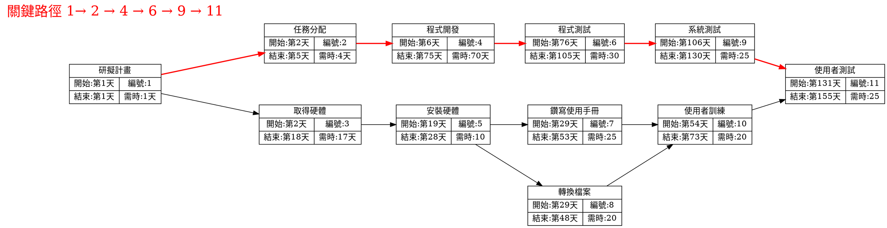
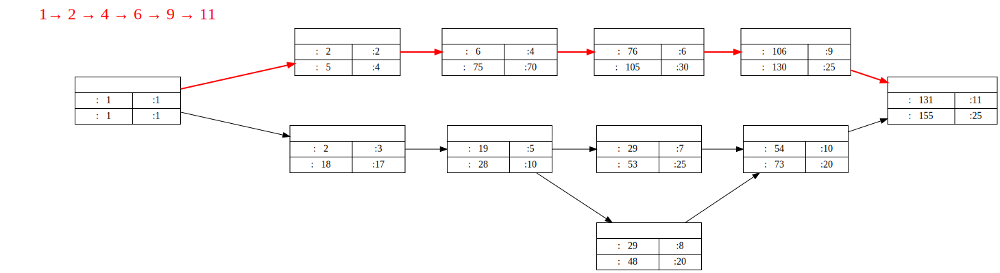

```graphviz
digraph G {
  rankdir="LR";
  node[shape=record];
  ranksep = .75
	nodesep = 1
  
  node1[label = "研擬計畫 | {{開始:第1天 | 結束:第1天} | {編號:1 | 需時:1天}} "];
  node2[label = "任務分配 | {{開始:第2天 | 結束:第5天} | {編號:2 | 需時:4天}} "];
  node3[label = "取得硬體 | {{開始:第2天 | 結束:第18天} | {編號:3 | 需時:17天}} "];
  node4[label = "程式開發 | {{開始:第6天 | 結束:第75天} | {編號:4 | 需時:70天}} "];
  node5[label = "安裝硬體 | {{開始:第19天 | 結束:第28天} | {編號:5 | 需時:10}} "];
  node6[label = "程式測試 | {{開始:第76天 | 結束:第105天} | {編號:6 | 需時:30}} "];
  node7[label = "鑽寫使用手冊 | {{開始:第29天 | 結束:第53天} | {編號:7 | 需時:25}} "];
  node8[label = "轉換檔案 | {{開始:第29天 | 結束:第48天} | {編號:8 | 需時:20}} "];
  node9[label = "系統測試 | {{開始:第106天 | 結束:第130天} | {編號:9 | 需時:25}} "];
  node10[label = "使用者訓練 | {{開始:第54天 | 結束:第73天} | {編號:10 | 需時:20}} "];
  node11[label = "使用者測試 | {{開始:第131天 | 結束:第155天} | {編號:11 | 需時:25}} "];
  
  node1 -> node2[color=red, penwidth=2]
  node2 -> node4[color=red, penwidth=2]
  node4 -> node6[color=red, penwidth=2]
  node6 -> node9[color=red, penwidth=2]
  node1 -> node3
  node3 -> node5
  node5 -> node7
  node5 -> node8
  node7 -> node10
  node8 -> node10
  node9 -> node11[color=red, penwidth=2]
  node10 -> node11
  
  tip[shape=plaintext, label="關鍵路徑 1→ 2 → 4 → 6 → 9 → 11", fontcolor=red, fontsize=24]
}
```

